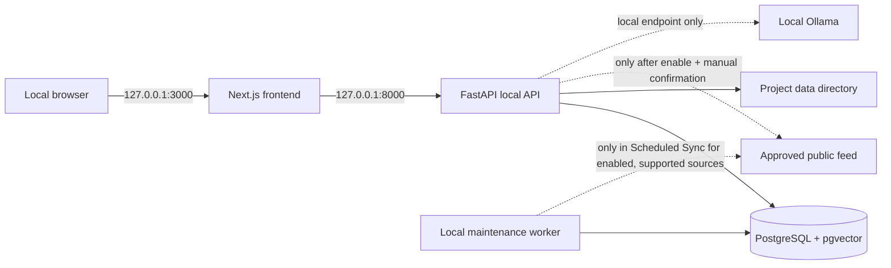

# Phase 2 Architecture

All browser-accessible services bind to `127.0.0.1`, not a public interface. Docker is used only as the local runtime. PostgreSQL data stays under the project `data/postgres/` directory; imported files and local exports live under the same project `data/` directory.

## Components

| Component | Purpose | External network behavior |
| --- | --- | --- |
| Next.js frontend | Local UI at port 3000 | None |
| FastAPI API | Local API and OpenAPI docs at port 8000 | Connector requests only after explicit user confirmation |
| PostgreSQL + pgvector | Structured records, full-text search, local vector column | None |
| Local worker | Scheduled sync, source retention, and local maintenance | Enabled supported feeds only while Scheduled Sync is selected |
| Ollama | Optional local LLM endpoint | Local endpoint only |
| Optional external AI | User-configured exception | Disabled by default; a selected request can send its prompt/evidence to the configured provider |

## Data safeguards

- Versioned SQL migrations create and evolve the local schema.
- Local imports are SHA-256 content-hashed before saving and duplicate-checked before indexing.
- Source documents preserve source URL, content hash, retrieval time, and raw content.
- Connector request logs record destination, time, outcome, status, and record counts.
- Original source data is separate from analyst and AI-derived fields.

## Current boundaries

Scheduled synchronization, hunt cases, incident notes, evidence hashing, retention, import review, technology-aware relevance, IOC lifecycle, detection lifecycle, and local validation records are implemented local capabilities. Semantic retrieval, source corroboration, automated response, SIEM control-plane access, and active scanning remain intentionally out of scope.
