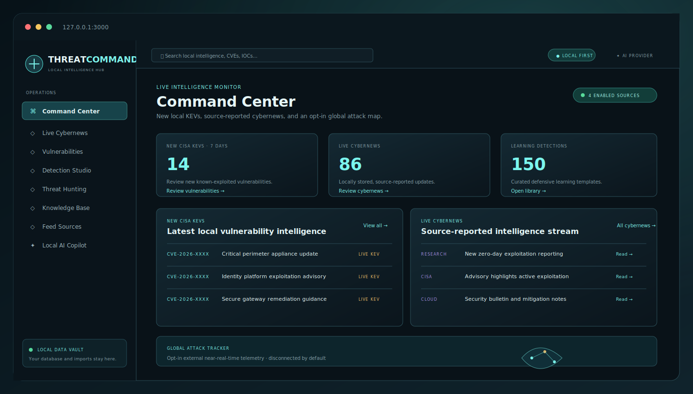

# ThreatCommand Local

> A local-first cybersecurity command center for staying current on CISA KEVs, cybernews, defensive detections, and investigation knowledge—without handing your workspace to a hosted platform.

<p align="center">
  
</p>

<p align="center"><sub>Illustrative Command Center preview. Your locally synchronized sources, records, and settings determine what appears in the application.</sub></p>

## Why ThreatCommand Local?

| Stay current | Learn defensively | Keep control |
| --- | --- | --- |
| Review new CISA KEVs and source-reported cybernews in one focused workspace. | Study 150 defensive detection templates across On-Prem, Cloud, and Incident Response. | Run locally on your computer with opt-in feeds, Offline Mode, local data controls, and no hosted account. |

## Start in three steps

```powershell
git clone https://github.com/UnderDogProfessor/ThreatCommand-Local.git
cd ThreatCommand-Local
.\start-local.bat
```

Then open http://127.0.0.1:3000 and create your local workspace passphrase.

> ThreatCommand Local stores source-reported intelligence on your device. Treat every record as intelligence to validate, never as proof of local compromise, exposure, attribution, or vulnerability.

## Privacy promise

- The web app, API, and database bind to `127.0.0.1` only.
- No analytics, telemetry, hosted database, registration, billing, or remote logging is used.
- Manual Sync is the initial default. Every connector is initially disabled except where the local user later enables it.
- Offline Mode blocks every connector request.
- Enabling a connector requires a disclosure acknowledgement; Manual Sync then requires a second confirmation immediately before the outbound request.
- Ollama is restricted to a local endpoint (`localhost` or `host.docker.internal`) and has no cloud fallback. Optional external AI is disabled by default and needs a separate local `.env` configuration, in-product provider selection, and a per-request disclosure.
- Local semantic retrieval is opt-in. Reviewed knowledge is sent only to the configured local Ollama embedding endpoint when the user explicitly rebuilds its local index; vectors remain in the local pgvector database.

## Start the local app

Prerequisite: Docker Desktop must be running. Ollama is optional until you use the Local AI Copilot.

```powershell
cd G:\Projects\Threat--Command-Final
.\start-local.bat
```

The first run downloads Docker base images and app packages. It requires an Internet connection and may take several minutes. It does **not** synchronize a threat feed or transmit your project data.

When ready, open:

- App: http://127.0.0.1:3000
- Local API health: http://127.0.0.1:8000/api/health
- Local OpenAPI docs: http://127.0.0.1:8000/docs

Verify readiness:

```powershell
.\health-check.bat
```

Stop services while preserving the database:

```powershell
.\stop-local.bat
```

## Prepare a public clone

The project is published under the [MIT License](LICENSE). Before treating a public release as complete, replace the placeholder private security contact in `SECURITY.md` and confirm that `.env` plus all `data/` folders remain untracked.

Anyone cloning the published repository should be able to run:

```powershell
git clone <your-repository-url>
cd Threat--Command-Final
.\start-local.bat
```

The first start copies `.env.example` to `.env` and replaces the placeholder with a unique local database password. The user then creates their own Local Access Protection passphrase in the browser. The GitHub workflow builds the containers, runs backend unit tests, checks dependencies, starts the local stack, and checks both localhost health endpoints on each push and pull request.

## Local data and configuration

| Location | Contents |
| --- | --- |
| `data/` | Local imports, exports, logs, and backup files |
| `data/postgres/` | PostgreSQL and pgvector data |
| `.env` | Local database, network-mode, and optional Ollama settings |

The starter creates a unique long database password in `.env` on first run; do not commit `.env`. Existing deployments must keep their configured password aligned with the local PostgreSQL data volume. If you set a password manually, do so before the first start.

On first use, ThreatCommand requires a local workspace passphrase before it exposes intelligence through the dashboard or API. It stores only a slow salted verifier in the local database, uses an HTTP-only browser session for up to eight hours, and adds CSRF checks to local write requests. Keep the passphrase in your password manager; it cannot be recovered by the dashboard.

### Optional: enable local semantic retrieval

The Knowledge Base always supports PostgreSQL keyword search. To add semantic search and grounded Copilot citations without using a cloud embedding service:

1. Install an Ollama embedding model that returns **768-dimensional** vectors (for example, a compatible `nomic-embed-text` model).
2. Set `OLLAMA_EMBEDDING_MODEL=<your-installed-model>` in your untracked `.env` file.
3. Run `.\update-local.bat` or restart the stack with `.\stop-local.bat` then `.\start-local.bat`.
4. Open **Knowledge Base**, choose **Rebuild local index**, and type `REINDEX` to confirm.

Indexing is never automatic. If Ollama is unavailable, the app labels the fallback and uses local keyword retrieval instead. Rebuilding after adding or deleting reviewed knowledge keeps semantic coverage honest.

## Current capabilities

- PostgreSQL + pgvector database with versioned SQL migrations.
- FastAPI local API and OpenAPI reference.
- Local threat, vulnerability, action, detection, knowledge-base, connector, and digest records.
- Full-text local search across threats, CVEs, and knowledge items.
- Local file imports: `.txt`, `.md`, `.csv`, `.json`, `.stix`, and `.misp`; imports are hashed, staged, and require local review before indexing.
- Explicit local deletion for staged/approved imports, raw source content, and handover exports; each destructive action requires typing its confirmation word.
- CISA KEV connector implementation with provenance and request logging. It is disabled by default.
- Five user-supplied public RSS connectors, plus MITRE ATT&CK STIX, all disabled by default.
- A Command Center focused on locally synchronized KEVs, source-reported news, learning detections, local evidence details, and an opt-in external map.
- 150 curated defensive learning templates: 50 each for On-Prem, Cloud, and Incident Response, organized as Beginner, Intermediate, and Advanced learning paths.
- A guided Detection Lab with three bundled, benign scenarios per learning template: an expected signal, a harmless administrative look-alike, and missing-telemetry practice. It never runs a query, command, attack technique, or external integration.
- Progressive detection learning guidance for configuration, tuning, interview preparation, and locally saved lab results.
- Opt-in local semantic retrieval: reviewed knowledge is chunked locally, embedded only through a configured localhost Ollama model, stored in pgvector, cited by the Copilot, and deleted with its source item. PostgreSQL keyword retrieval remains the explicit fallback.
- Local Ollama status and a bounded Copilot retrieval endpoint; all answers remain draft analysis requiring evidence review.
- Detection Studio support for Sigma, Microsoft Sentinel KQL, and defensive pseudocode drafts. Sigma is parsed locally with pySigma, while KQL remains a non-executing structural advisory.
- Local Markdown digest generation and encrypted database backup/restore scripts, using Windows DPAPI when available and a passphrase-protected authenticated-encryption fallback otherwise.
- A non-destructive backup verification drill that restores into an isolated temporary database, verifies the schema and key record counts, and removes the temporary database without changing the live workspace.

## Practice detections in three steps

Open **Detection Lab** in the local dashboard and follow the on-screen flow:

1. Choose a learning detection from On-Prem, Cloud, or Incident Response.
2. Pick a bundled safe scenario and run the local learning check.
3. Open the focused configuration, tuning, or interview guidance when you are ready.

The lab uses preloaded event metadata only. A recorded result shows whether the limited local learning evaluator observed the expected result; it is not proof that the detection is deployed, production-ready, or effective in a real environment. Raw sample data and previous practice results remain optional, expandable details so the main workflow stays simple.

## Network and connector workflow

1. Keep **Offline Mode** enabled when no network activity is permitted.
2. In **Manual Sync Mode**, review the source URL, destination, data type, and provider disclosure on the Feed Sources page.
3. Enable the connector only after accepting the disclosure.
4. Use **Sync now** and confirm the exact outbound request, or explicitly enable Scheduled Sync in Settings for enabled, parser-supported sources.
5. Review the local request log, source health, and records added/updated.

A feed provider can observe the public IP address that retrieves its data. Respect provider terms, licensing, rate limits, and access restrictions. Do not enable a source you are not authorized to use. The external attack map, when loaded, is a separate browser-direct request and is unavailable in Offline Mode.

## Backup and restore

Create a Windows-user-protected local PostgreSQL backup and integrity manifest. Secrets are intentionally excluded:

```powershell
.\backup-local.bat
```

Backups are saved under `data\backups`. Keep encrypted copies on an external drive you control. Restore is destructive and requires an explicit confirmation:

```powershell
.\restore-local.bat data\backups\threatcommand-YYYYMMDD-HHMMSS.dump.dpapi
```

## Updating

`update-local.bat` may download updated container images and packages. It asks for confirmation before doing so. Review changes and take a backup first.

## Troubleshooting

- **Docker Desktop is not ready:** open Docker Desktop and wait until it reports that the engine is running.
- **Port 3000, 5432, or 8000 is busy:** stop the conflicting local program, then run `start-local.bat` again.
- **API health check fails:** run `docker compose ps` and then `docker compose logs api` in this folder.
- **Ollama is unavailable:** Copilot stays disabled; the rest of the app remains functional. Start Ollama locally and set an installed model name in `.env` when you are ready.
- **Need no networking at all:** use Offline Mode in Settings before enabling any source. You can still work with records already stored locally.

See [ARCHITECTURE.md](ARCHITECTURE.md), [PRIVACY.md](PRIVACY.md), [CONNECTORS.md](CONNECTORS.md), and [BACKUP-RESTORE.md](BACKUP-RESTORE.md) for the operational details.
